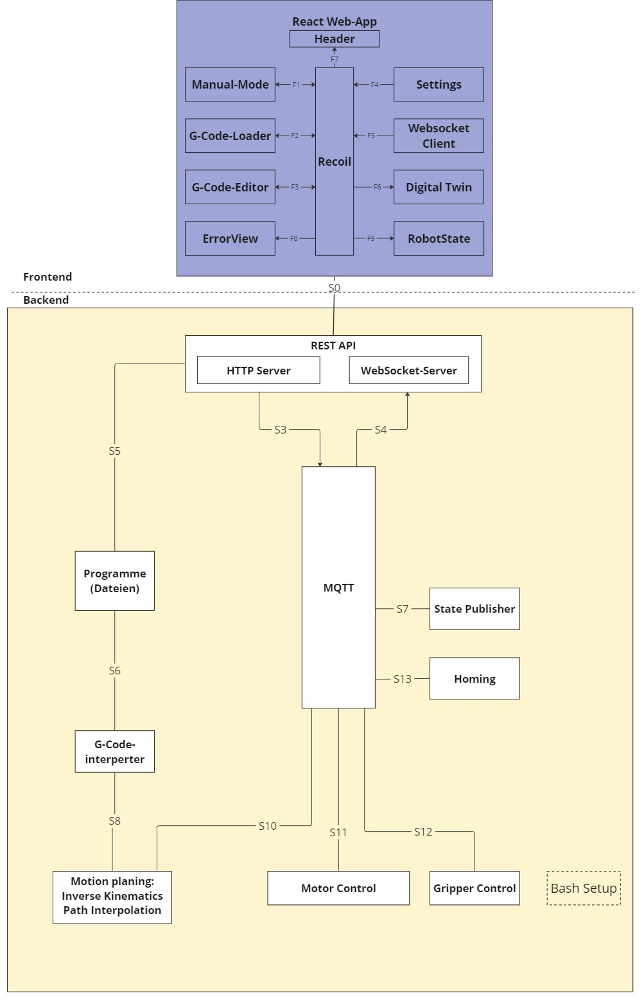

# Delta Robot Project

Welcome to the Delta Robot Project repository. This project is developed as part of a DHBW Mosbach initiative, undertaken by two Infortronics students. We were responsible for the software and electronics aspects of the delta robot. The project demonstrates a comprehensive approach to robot control and simulation, integrating advance software engineering and electronic design.

## Project Overview

This project utilizes a modular web application architecture, developed using React, which supports highly scalable and maintainable code. The system is designed around a microservices architecture, enhancing flexibility and allowing individual services to be developed, deployed, and scaled independently.

Key components of the application communicate in real-time through WebSockets for instantaneous user interaction and MQTT for reliable inter-service messaging. This architecture not only facilitates robust, real-time communication but also ensures that the system can easily adapt to changes in processing demands or functionality.



## Features

- **Real-time Control and Visualization**: Control and observe the delta robot within an interactive 3D environment.
- **G-Code Support**: Load, edit, and execute G-Code to control the robot movements.
- **Manual Control**: Direct control over the robot's movements through manual inputs.
- **System State Monitoring**: Monitor and display the current state of the robot.

## Technologies

- **Frontend**:
   - **React**: Used for building the web app interface.
   - **Recoil**: Manages state within the app, providing a more dynamic user experience.
   - **ThreeJS**: Utilized for rendering the digital twin in a 3D environment.
   - **WebSocket**: Facilitates real-time communication between the backend and frontend.

- **Backend**:
   - **Express**: Serves as the HTTP server and manages the WebSocket server for real-time web communication.
   - **MQTT (Mosquitto and Paho)**: Manages communication between all backend services, ensuring efficient message dispatch and handling.
   - **PIGPIO**: Allows for advanced real-time GPIO control using Direct Memory Access in C, optimizing performance for critical operations.
   - **RPI.GPIO**: Used for general GPIO control via Python, providing a flexible interface for less time-sensitive tasks.


## Installation

Follow these steps to set up the project locally:

1. **Clone the Repository**

   ```bash
   git clone https://github.com/MayarAnon/Deltaroboter.git
   cd Deltaroboter
## Usage
After starting the application, you can access the web interface via http://localhost:3000 to control and observe the delta robot.


## License
This project is licensed under the MIT License. See the LICENSE file for details.

## Authors
Dennis Roth & 
Mayar Hanhon
## Contact
For more information, please contact us.
